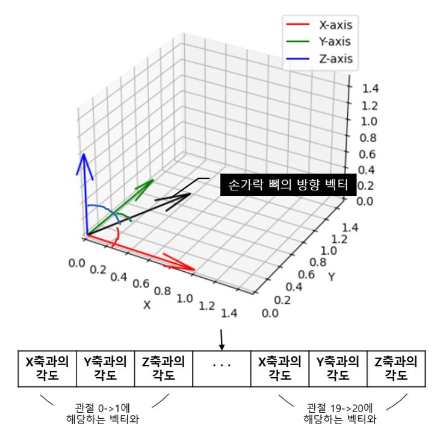
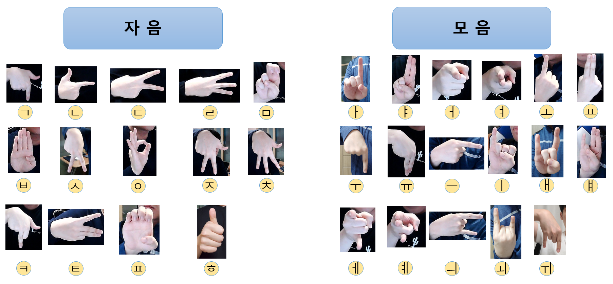
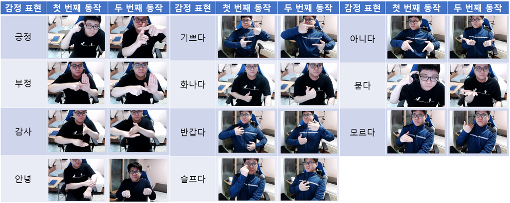
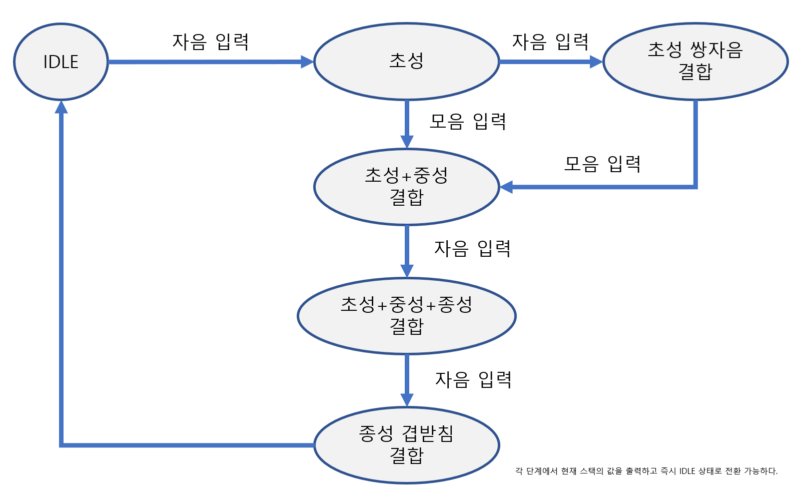
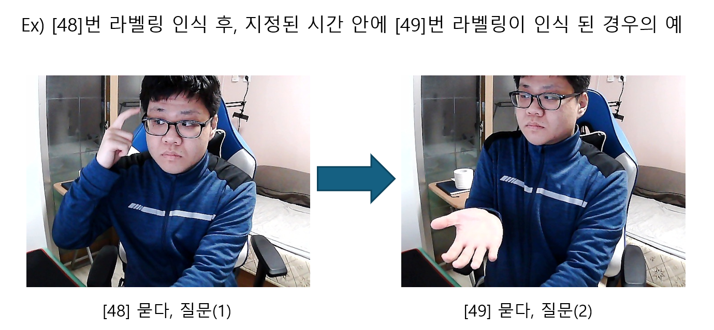
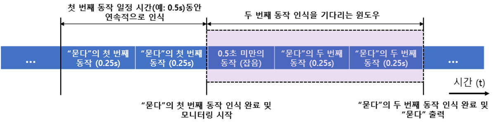

# Mediapipe 기반 한글 수어 번역기 ✋🧠

본 프로젝트는 **MediaPipe**와 **Random Forest 분류기**를 이용하여  
카메라에서 손 모양을 인식하고, 한글 수어를 실시간으로 번역하는 시스템입니다.

---

## 🎬 실행 결과

> 아래는 실제 프로그램의 실시간 수어 번역 동작 화면입니다.

  


---

## 🖐️ MediaPipe Hands

> 본 프로젝트는 Google의 **MediaPipe Hands** 모델을 사용하여  
> 손가락 관절 위치를 정밀하게 추출하고, 이를 기반으로 수어 인식을 수행합니다.

  
<sub>출처: Google, Mediapipe</sub>

### 🧠 관절 벡터 기반 정규화 방식

MediaPipe에서 추출한 관절 위치는 **손의 각도, 위치, 개인의 손 크기 차이** 등에 따라 달라지기 때문에,  
이를 직접 사용하는 데 한계가 존재합니다.  
본 프로젝트는 이를 보정하기 위해:

- **인접한 두 관절점을 벡터로 변환**



- 해당 벡터를 **arccos 함수로 각도로 변환**
- 위치 및 크기에 대한 영향을 줄이고 **정확도 향상**

위와 같은 **벡터 각도 기반의 특징 벡터**를 활용하여  
보다 안정적이고 일반화된 수어 인식을 구현하였습니다.

---

## 📌 주요 기능

- **한글 자음 14종 + 모음 17종 + 감정 표현 11종 인식 가능**
- 인식된 자음/모음은 텍스트 영역에 누적되며 **문장 조립 가능**
- **Backspace**, **글자 나누기**, **전체 삭제** 등의 **텍스트 조작 기능 제공**
- **슬라이딩 윈도우 기반**으로 안정적이고 정확한 실시간 인식 처리

---

### 🖼️ 인식 가능 표현

#### ▪ 자음/모음 예시



#### ▪ 감정 표현 예시



---

## 🗂️ 구성 파일

```
sign-language-translator/
│
├── notebooks/             # Jupyter 노트북 (데이터 수집/학습/실행)
│   ├── create_dataset.ipynb
│   ├── train_classifier.ipynb
│   ├── inference_classifier.ipynb
│   └── unicode.py
│
├── models/                # 학습된 모델 파일 (.p)
│   └── model.p
│
├── data/                  # 피클 데이터 파일 (.pickle)
│   └── data.pickle
│
├── docs/                  # 논문, 이미지, GIF 등 설명 자료
│   ├── 실행_결과_예시1.gif
│   ├── 실행_결과_예시2.gif
│   ├── MediaPipe_Hands.png
│   ├── 지문자.png
│   ├── 연속동작.png
│   ├── 유한상태머신_지문자.PNG
│   ├── 묻다_질문_출력.png
│   ├── 벡터_및_각도_계산.jpg
│   ├── 연속동작_출력_방식.png
│   └── Sign Language Translation Program with Mediapipe.pdf
│
├── requirements.txt       # 필요 패키지 목록
└── README.md
```

> ▪ 참고:
>
> - **models/** 폴더가 없으면 직접 생성해야 합니다.
> - **unicode.py** 파일은 `notebooks/` 폴더에 위치해야 정상적으로 import 됩니다.
> - unicode.py 파일은 한글 초성/중성/종성 분리 및 조합 기능을 위해 사용된 외부 참고 스크립트입니다.

---

## ✅ 개발 환경

- Python 3.11 이상
- PyTorch 2.x 권장 (※ PyTorch 1.10.1은 Python 3.9 이하에서만 설치 가능)

---

### 📥 설치 방법

1. 가상환경 생성 (선택)

   ```bash
   conda create -n signlang_env python=3.11
   conda activate signlang_env
   ```

2. PyTorch 설치

   ```bash
   pip install torch torchvision torchaudio
   ```

3. 기타 의존성 설치
   ```bash
   pip install -r requirements.txt
   ```

---

## 🚀 실행 방법

필요에 따라 ① or ② 과정을 진행해주세요.

### ① 준비된 모델 사용 (간편 실행)

1. 학습된 모델 다운로드:

   👉 [📦 Releases에서 model.p 다운로드](https://github.com/Joycong/Sign-Language-Translation-Program-with-Mediapipe/releases)

2. `models/` 폴더에 `model.p` 파일을 넣고  
   `notebooks/inference_classifier.ipynb` 를 실행합니다.

> models/ 폴더가 없다면 수동으로 만들어주세요.

> ✅ 이 방법은 바로 인터페이스를 실행할 수 있는 간편 모드입니다.

---

### ② 직접 데이터 수집 및 모델 학습

본인만의 수어 데이터를 사용하고 싶다면 다음 절차를 따르세요:

1. **data/** 폴더 하위에 0번부터 52번까지 서브폴더를 만들어야 합니다.
   **0~52번 폴더를 생성**하고, 각 폴더에 학습할 이미지 수집해주세요.

   - 📢 최소 2장 이상의 이미지가 필요합니다. (train_test_split stratify 사용 시 오류 방지)
   - 참고: 0-30번 폴더 → 일반 지문자, 31-52번 폴더 → 연속 동작(감정표현)

2. `create_dataset_ver_simple.ipynb` 실행 → `data.pickle` 생성
3. `train_classifier_ver_simple.ipynb` 실행 → 모델 학습 및 `models/model.p` 저장
4. `inference_classifier.ipynb` 실행 → 수어 번역 UI 사용

---

## 🖥️ 인터페이스 설명

### 1. 지문자 조합 및 텍스트 조작

- 인식된 자음/모음은 텍스트 영역에 순차적으로 누적되며 문장으로 조합됩니다.
- 특정 제스처를 인식시켜 텍스트 영역을 조작할 수 있습니다.
  - **한 글자 삭제** : [묻다2] (50) → 한 손 연속 동작
  - **글자 나누기** : [슬프다2] (46) → 한 손 연속 동작
  - **스택 초기화 (전체 글자 삭제)** : [안녕2] (38) → 양손 연속 동작

> 글자 나누기/삭제는 빠르게 처리 가능하도록 한 손 제스처로,  
> 전체 초기화는 신중하게 하기 위해 양손 제스처로 구성되었습니다.  
> **동작을 1~2초 이상 인식** 시 조작이 발동됩니다.

> 상태 전이 기반으로 동작하는 유한 상태 머신 구조 사용  
> 

---

### 2. 연속 동작 인식

- 감정 표현, 특정 단어는 **정해진 순서의 손동작**으로 인식됩니다.

> 연속 동작 정의 테이블  
>   
> 

---

## 📄 논문 자료

해당 프로젝트는 **한밭대학교 캡스톤디자인** 연구 결과물로,  
자세한 내용은 아래 논문에서 확인할 수 있습니다:

📎 [📘 논문 보기](./docs/Sign%20Language%20Translation%20Program%20with%20Mediapipe.pdf)

---

## 👨‍💻 개발자

- **전우진** (GitHub: [@Joycong](https://github.com/Joycong))
- **이득영**
